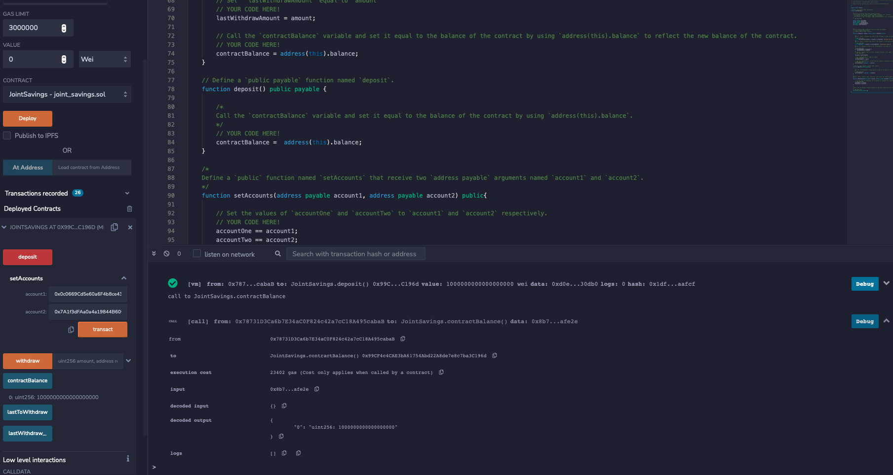
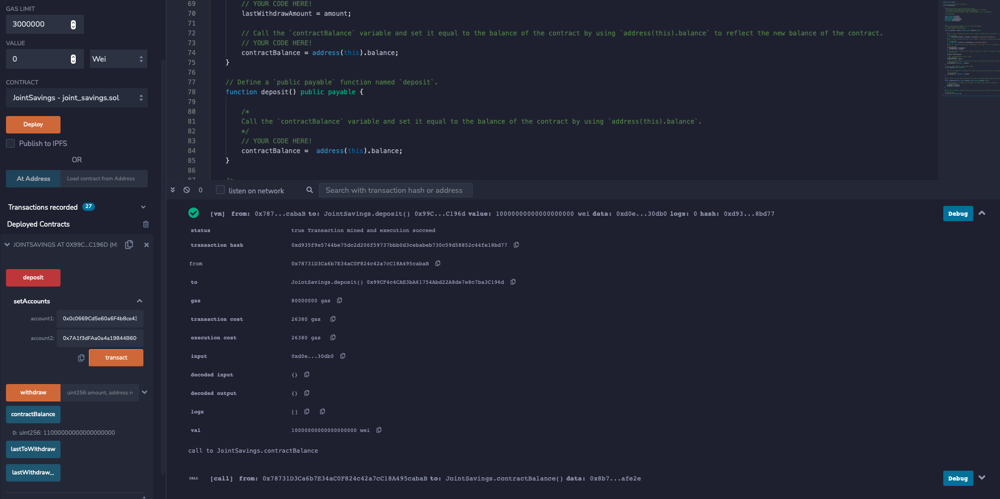
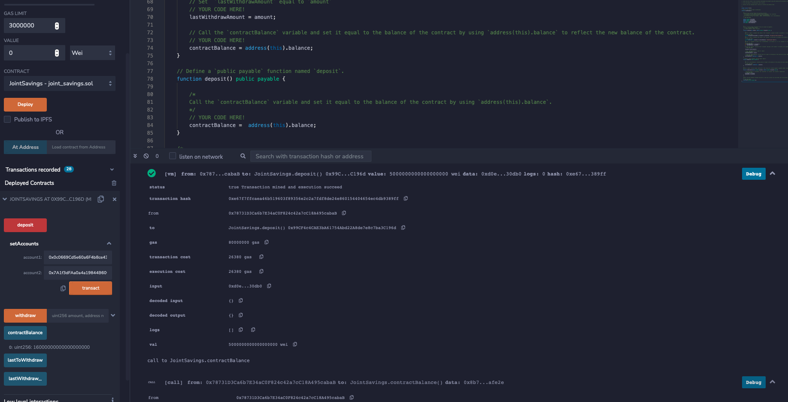

# Joint Savings Account


### Description

This project would be suitable for a fintech startup company who is disrupting the finance industry with its own cross-border, Ethereum-compatible blockchain that connects financial institutions. The task is to build smart contracts to automate many of the institutions’ financial processes and features, such as hosting joint savings accounts.

To automate the creation of joint savings accounts, I am creating a Solidity smart contract that accepts two user addresses. These addresses will be able to control a joint savings account. My smart contract will use ether management functions to implement a financial institution’s requirements for providing the features of the joint savings account. These features will consist of the ability to deposit and withdraw funds from the account.

### Steps Taken

1. Create a Joint Savings Account Contract in Solidity

2. Compile and Deploy Contract in the JavaScript VM

3. Interact with Deployed Smart Contract

### Testing

1. Using the `setAccounts` function to define the authorized Ethereum address that will be able to withdraw funds from the  contract.

   
    > ```text
    > Dummy account1 address: 0x0c0669Cd5e60a6F4b8ce437E4a4A007093D368Cb
    > Dummy account2 address: 0x7A1f3dFAa0a4a19844B606CD6e91d693083B12c0
    > ```

2. Testing the deposit functionality of the smart contract by sending the following amounts of ether. After each transaction, using the `contractBalance` function to verify that the funds were added to the contract:

    * Transaction 1: Send 1 ether as wei.

    * Transaction 2: Send 10 ether as wei.

    * Transaction 3: Send 5 ether.

3. Once deposited funds are successfully deposited into the contract, testing the contract’s withdrawal functionality by withdrawing 5 ether into `accountOne` and 10 ether into `accountTwo`. After each transaction, using the `contractBalance` function to verify that the funds were withdrawn from the contract. Also, using the `lastToWithdraw` and `lastWithdrawAmount` functions to verify that the address and amount were correct.

### Execution Results

## Set Accounts


## Deposit 1 Ether as Wei


## Deposit 10 Ether as Wei


## Deposit 5 Ether as Wei

